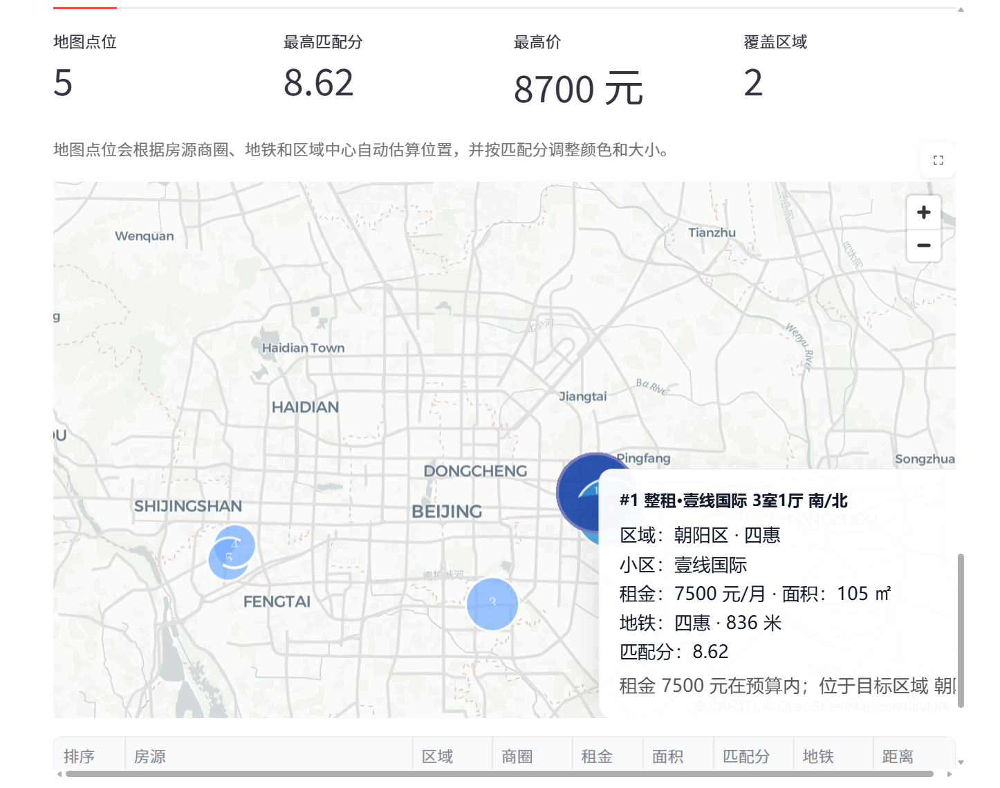

# 巢选 HomeAgent

巢选（HomeAgent）是一个面向租房场景的项目，旨在探索大语言模型、结构化检索、向量检索与可视化交互在垂直业务中的协同应用，实现从自然语言租房需求理解到房源推荐、知识补充、地图展示和多轮对话交互的完整流程。

与传统的问答式演示不同，巢选更强调“面向业务场景的 Agent 编排能力”。系统不仅能够理解用户输入的预算、区域、户型、地铁偏好等条件，还能够结合结构化房源字段、向量检索结果和大模型总结能力，输出更接近真实产品体验的推荐结果。

---

## 项目定位

本项目定位为一个垂直场景下的智能体原型系统，主要展示以下功能：

- 面向租房场景的自然语言需求解析
- 基于结构化字段的候选房源筛选与排序
- 基于 Chroma 的轻量 RAG 检索增强流程
- 基于 LangGraph 的 LLM 工作流编排
- 交互式产品页面


---

## 核心能力

### 1. 自然语言租房需求理解

系统支持将中文租房表达解析为结构化条件，例如：

- 区域：朝阳区、海淀区、丰台区等
- 户型：开间、一室一厅、两室一厅、三室一厅
- 预算：预算上限、预算区间
- 偏好标签：近地铁、精装、可月付、整租等

### 2. 房源检索与推荐

系统将房源推荐拆分为多个可控步骤：

- 结构化条件检索
- 候选房源召回
- 规则打分与排序
- 自动放宽条件的兜底策略
- LLM 总结推荐理由与下一步建议

### 3. 检索增强生成（RAG）

项目当前已集成基于 `ChromaDB` 的轻量 RAG 流程，用于：

- 房源语义检索
- 推荐解释补充
- 租房知识片段召回

检索结果会被注入 `LangGraph` 工作流，参与最终的 LLM 生成过程。

### 4. 多轮记忆与交互

系统支持对用户画像和最近对话进行持久化管理，包括：

- 历史预算偏好
- 常用区域偏好
- 户型偏好
- 收藏房源
- 最近对话记录

### 5. 可视化展示

- 对话式找房
- 左侧筛选器
- 收藏与对比
- 房源详情查看
- 智能地图 / 热力图 / 区域分布
- 语音输入与转写




---

## 项目结构

```text
homeagent/
  app/                    # Agent 主编排与工具注册
  config/                 # 项目配置、模型配置、Chroma 配置
  data/                   # 原始数据、处理后房源、用户记忆
  domain/                 # 领域模型
  infrastructure/         # 数据源、索引构建、向量检索
  interfaces/             # CLI 与 Web 入口
  knowledge/              # 向量文档与知识说明
  prompts/                # LLM 提示词
  services/               # 需求解析、排序、推荐、记忆
  utils/                  # 通用工具
  workflows/              # LangGraph / ReAct 工作流
  README.md
  requirements.txt
```

---

## 系统流程

项目当前的主执行链路如下：

1. 用户输入自然语言租房需求
2. LangGraph 调用大模型完成结构化需求解析
3. Agent 调用房源检索工具获得候选房源集合
4. Chroma 检索相关房源文本与知识片段
5. 排序模块根据预算、区域、户型、交通等因素进行打分
6. 大模型生成推荐总结、推荐理由和下一步建议
7. Web 页面以对话流、卡片、地图和对比视图进行展示

---

## 数据来源与说明

当前版本的数据主要来自抓包保存的房源 JSON 文件，仅用于自行学习使用。

```powershell
$env:HOMEAGENT_LLM_MODEL="qwen-flash"
$env:DASHSCOPE_API_KEY="your_api_key"
```


---

## 入口说明

当前正式入口如下：

- CLI：`homeagent/interfaces/cli.py`
- Web：`homeagent/interfaces/web_app.py`
- 索引构建：`homeagent/infrastructure/indexing/build_listing_index.py`


---

## 后续规划

- [ ] 扩充房源数据规模
- [ ] 接入 PDF / 合同 / 租房指南知识库
- [ ] 优化地图精度与区域边界展示
- [ ] 完善标签清洗与去重
- [ ] 增加测试与部署文档
- [ ] 提升多用户与持久化能力

---

